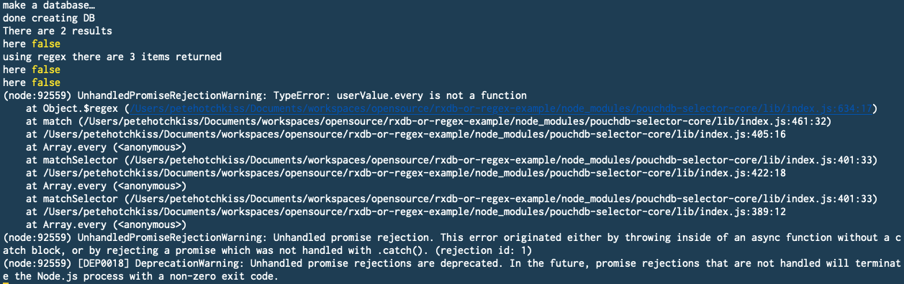

# Query Error

The included repos re-produces an error that has crept into `rxdb` in version 12.

It shows a simple database store (this one running in memory) that is unable to return query results which match using a regular expression.

## Instructions

1) Clone the repos
2) install dependencies
3) run `ts-node ./src/example.ts`

The query using `$eq` matching an exact string returns results as expected

The second query which tries to match against the `firstName` field using a `$regex` will not return any results.

The third query which attempts nested `$regex` queries inside an `$or` collection will throw an error as it doesn't get any matches.

**Note** there's also now some erroneous console logs that show _here false_
